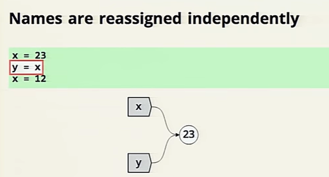
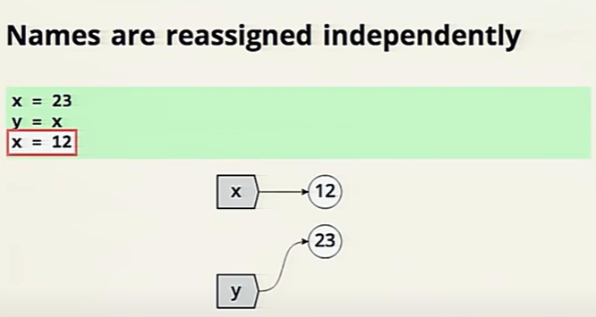
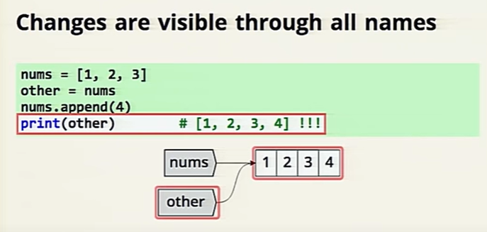
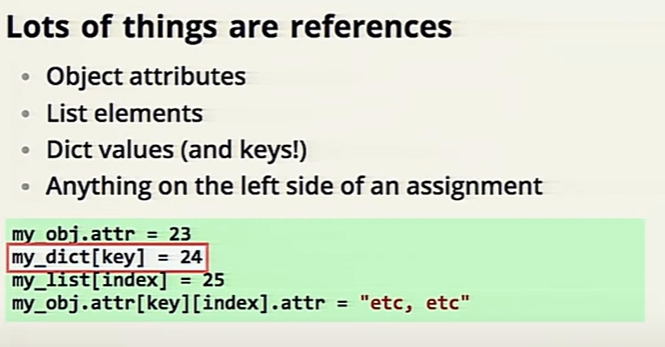

## Pain vs. Suffering

**Pain :** the price for accelerated learning

**Suffering :** is pain without purpose. Pain with no higher goal. Pain with no dreams, no ambition, no aspiration


## Big O notation 
Big O notation is sth used to describe the performance or complexity of an algorithm 

+ `O(1) describes an algorithm that will always execute in the same time (or space) regardless of the size of the input data set`

+ `O(N) describes an algorithm whose performance will grow linearly and in direct proportion to the size of the input data set `

+ `O(N²) represents an algorithm whose performance is directly proportional to the square of the size of the input data set`

+ `O(2^N) denotes an algorithm whose growth doubles with each addition to the input data set`

```
Binary search is a technique used to search sorted data sets.

``` 
## Facts and Myths about Python names and values

### Names are reassinged independently




### Mutable Aliasing:

* A mutable value
* more than one name
* the value changes
* all names see the change ,such as lists



### Immutable values can't alias 


### Mutable and Immutable are assigned tha same 
* Assignment is the same for all values 
* Alaising can make it seem different 

### Change is unclear 


### Lots of things are references

