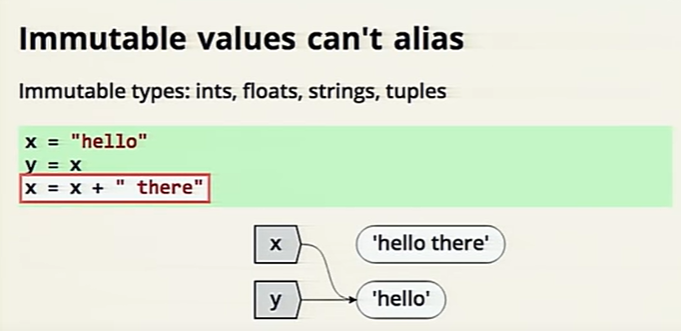
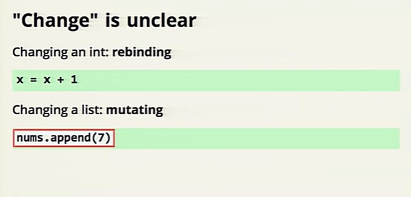

## Pain vs. Suffering

**Pain :** the price for accelerated learning

**Suffering :** is pain without purpose. Pain with no higher goal. Pain with no dreams, no ambition, no aspiration

## Facts and Myths about Python names and values

### Names are reassinged independently

### Mutable Aliasing:

* A mutable vlaue
* more than one name
* the value changes
* all names see the change ,such as lists

### Immutable values can't alias 

### Mutable and Immutable are assigned tha same 
* Assignment is the same for all values 
* Alaising can make it seem different 

### Change is unclear 

### Lots of things are references

