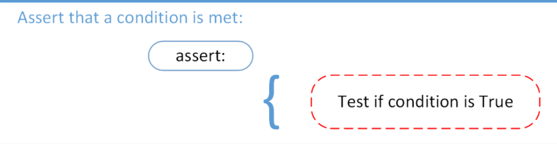
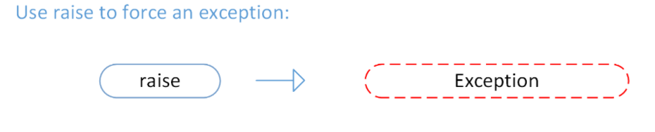
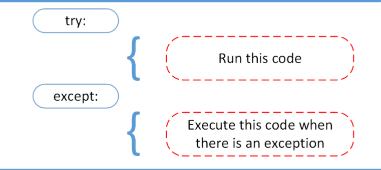

## Reading and Writing Files in Python 
Python provides inbuilt functions for writing and reading files. There are two types of files :

+ Text files: In this type of file, Each line of text is terminated with a special character called EOL (End of Line), which is the new line character (‘\n’) in python by default.

+ Binary files: In this type of file, there is no terminator for a line and the data is stored after converting it into machine understandable binary language  (written in binary language,0s and 1s).

Access modes govern the type of operations possible in the opened file. It refers to how the file will be used once its opened.There are 6 access modes in python:

1. Read Only (‘r’) : Open text file for reading.

2. Read and Write (‘r+’) : Open the file for reading and writing. 

3. Write Only (‘w’) : Open the file for writing. 

4. Write and Read (‘w+’) : Open the file for reading and writing.

5. Append Only (‘a’) : Open the file for writing. 

6. Append and Read (‘a+’) : Open the file for reading and writing.

**Opening files**

`File_object = open(r"File_Name","Access_Mode")`

**Closing files**

`File_object.close()`

**Writing to a file**

```python
1. File_object.write(str1)

2. File_object.writelines(L) for L = [str1, str2, str3] 

```

**Reading from a file**
```python
1. File_object.read([n])
2. File_object.readline([n])
3.   File_object.readlines()
```

**Appending to a file**

Example:
```python
file = open("myfile.txt","a")
file.write("Today \n")
file.close()
```

## Python Exceptions

A features in python to handle any unexpected error in your programs and to add debugging capabilities in them using a try statement or Assertion .The code that handles the exceptions is written in the except clause.If no exception occurs, the except block is skipped and normal flow continues(for last value)

**Assertion**


**Rasing-Error**


**Try-except**
