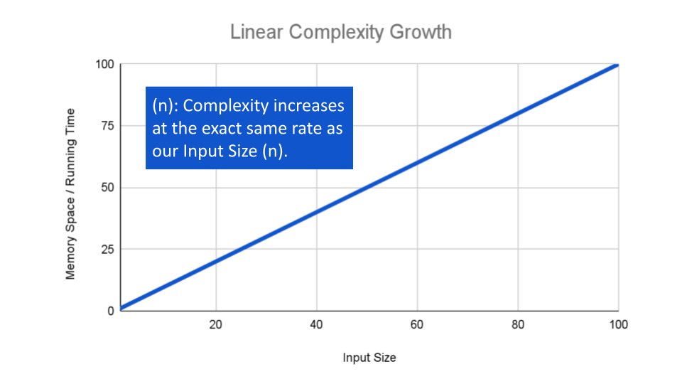

# Big O: Analysis of Algorithm Efficiency

it describe the worst case of the efficiency of an algorithm and this efficiency evaluated based on **Running time** or the time complexity and **Memory space** or the space complexity 

To analyze the time and space limiting factors, we should consider 4 Key Areas for analysis:

+ Input Size

refers to the size of the parameter values that are read by the algorithm.

+ Units of Measurement

for Running Time :

    - The time in milliseconds from the start of a function execution until it ends
    - The number of operations that are executed.
    - The number of “Basic Operations” that are executed

for Memory space :

    - The amount of space needed to hold the code for the algorithm
    - The amount of space needed to hold the input data
    - The amount of space needed for the output data
    - The amount of space needed to hold working space during the calculation
+ Orders of Growth

    - 

    - 
    - 
+ Best Case, Worst Case, and Average Case

## Linked Lists

a linear collection of data elements whose order is not given by their physical placement in memory. Instead, each element points to the next.

## Linked list types 

## Parts of a linked list
in the picture bellow you can see the linked list part 

### Linear data structures VS Non-linear data structures

**linear data structures** : means that there is a sequence and an order to how they are constructed and traversed

**non-linear data structures** : means that we could traverse the data structure non-sequentially.

### Memory management

## Big O for linked list 

* Inserting an element at the beginning of a linked list is particularly nice and efficient because it takes the same amount of time, no matter how long our list is, which is to say it has a space time complexity that is constant, or O(1). 

* But inserting an element at the end of a linked list we will follow these steps :
    - Find the node we want to change the pointer of (in this case, the last node)
    - Create the new node we want to insert and set its pointer (in this case, to null)
    - Direct the preceding node’s pointer to our new node