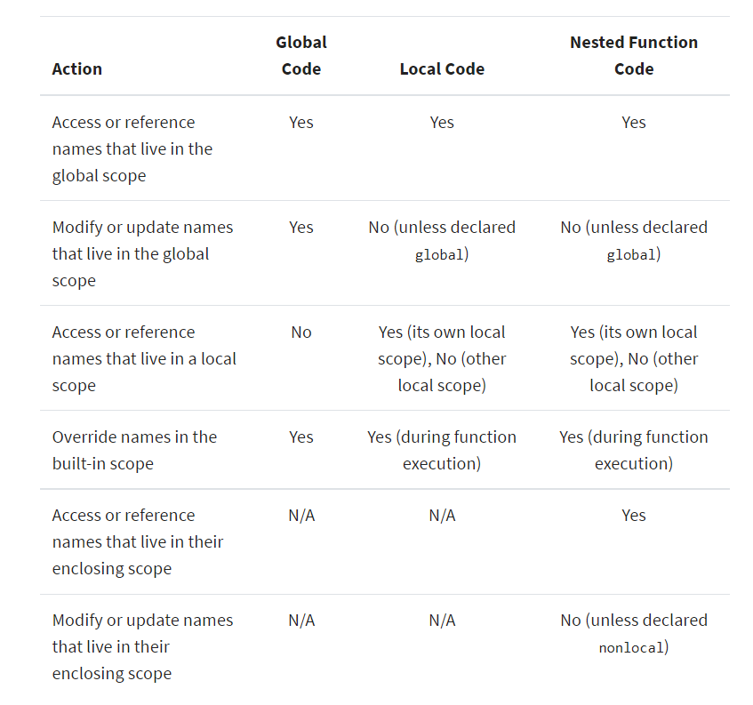

# Scope
 The area of a program in which you can unambiguously access that name, such as variables, functions, objects, and so on.
# Namespace
 A system that has a unique name for each and every object in Python. An object might be a variable or a method. Python itself maintains a namespace in the form of a Python dictionary 

## Global scope VS Local scope
+ **Global scope**: The names that you define in this scope are available to all your code.For example ,if you assign a value to a name outside of all functions—say, at the top level of a module—then that name will have a **global scope**.
```python
    result =0
>>> def cube(base):
...     result = base ** 3
...     print(f'The cube of {base} is: {result}')
...
>>> cube(30)
```
the scope for `result` variable is global ,this is means that it can be accessable from and where in the module 

+ **Local scope**: The names that you define in this scope are only available or visible to the code within the scope.For example, if you assign a value to a name inside a function, then that name will have a **local scope**

```python
>>> def cube(base):
...     result = base ** 3
...     print(f'The cube of {base} is: {result}')
...
>>> cube(30)
```
the scope for `base` variable is local ,this mean that it is not accessable from outside `cube `function 


## Implications of Python scope


## Big O notation 
We used it to express the upper bound of the runtime of an algorithm and thus measure the worst-case time complexity of an algorithm

+ O(1) - Constant Complexity
+ O(n) - Linear Complexity
+ O(n2) - Quadratic Complexity
+ O(log n) - Logarithmic Complexity
+ O(n3) - Cubic Complexity
+ O(n log n) - Linearithmic Complexity
+ O(2n) - Exponential Complexity